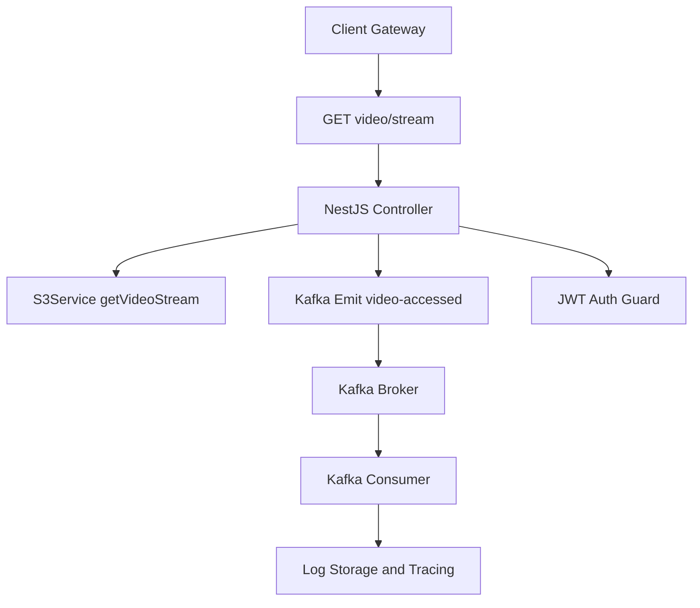

# Video Streaming Service (NestJS + Kafka + S3)

Este projeto é um serviço de backend responsável por entregar vídeos em formato de streaming, utilizando NestJS com integração a Kafka, autenticação com JWT, armazenamento no S3 (mockado via LocalStack), e observabilidade com OpenTelemetry.

---

## Visão Geral

- **Backend:** NestJS
- **Mensageria:** Kafka (via KafkaJS)
- **Armazenamento:** S3 (LocalStack - armazenamento dos videos e PostgreSQL para armazenamento dos logs)
- **Segurança:** JWT
- **Observabilidade:** OpenTelemetry + Jaeger + Prometheus + Grafana

---

## Arquitetura



## Estrutura do projeto

```bash
src/
├── auth/ # JWT auth module
├── video/ # Streaming controller + DTOs
├── kafka/ # KafkaModule, Producer, Consumer
├── s3/ # S3Service + mock config
├── interceptors/ # ErrorInterceptor
├── logger.ts # Winston logger
├── tracing.ts # OpenTelemetry setup
├── main.ts # Bootstrap App
```

## Setup Local

### Pré requisitos

- **Node.js 22+**
- **Yarn ou NPM**
- **Docker**

### Instalação

1- Instalando as dependências e subindo os container

```bash
yarn install
yarn docker:dev  #roda o docker-compose executando em segundo plano (detached).
```

2- Criação do Bucket no S3 do localstack e subindo um video para testes

```bash
yarn s3:all-flow  # executa os stripts que cria o bucket e faz upload de um video (/assets/videos)
```
