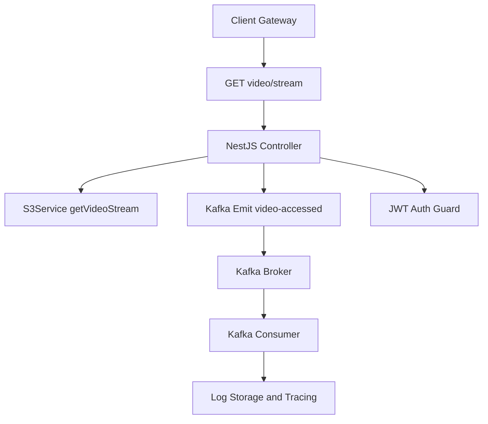

# Visão Geral

Este serviço é responsável pelo streaming de vídeos armazenados no S3 (inicialmente mockado com LocalStack),
controlando o acesso via JWT e registrando logs de acesso com Kafka.

Componentes principais:

- NestJS (backend)
- Kafka (mensageria)
- LocalStack (mock do S3)
- JWT (autorização e autenticação)
- Jaeger / Prometheus / Grafana (observabilidade via OpenTelemetry)

# Arquitetura

